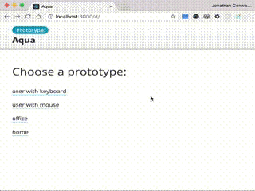

# prototype-controls

Control aspects of your prototype within the prototype itself.



Bootstrapped with [create-react-app-minimal](http://conwy.codes/cram).

## Getting started

### Using

To activate the controls, simply press <kbd>Ctrl</kbd> + <kbd>=</kbd>. Press the same combination to close them.

### Installing

```
npm install prototype-controls
```

### Importing

#### React

Import PrototypeControls directly and use it as a React wrapper component.

```js
import React from 'react'

import PrototypeControls from 'prototype-controls'

class App extends Component {
  handleNameChange = e =>
    this.setState({ name: e.target.value })

  handleFillInNameClick = () =>
    this.setState({ name: 'Elise' })

  render = () =>
    <div>
      <div>
        <label>Enter your name</label>
        <input type="text" onChange={this.handleNameChange} value={this.state.name} />
      </div>

      <PrototypeControls>
        <button onChange={this.handleFillInNameClick}>Fill in name</button>
      </PrototypeControls>
    </div>
}
```

## Contributing

You're welcome to fork and/or contribute pull-requests and issues to the project.

### Cloning and installing

```bash
git clone https://github.com/jonathanconway/prototype-controls
cd prototype-controls
npm install
```

### Running examples

```bash
npm start
```

### Running tests

```bash
npm test
```
